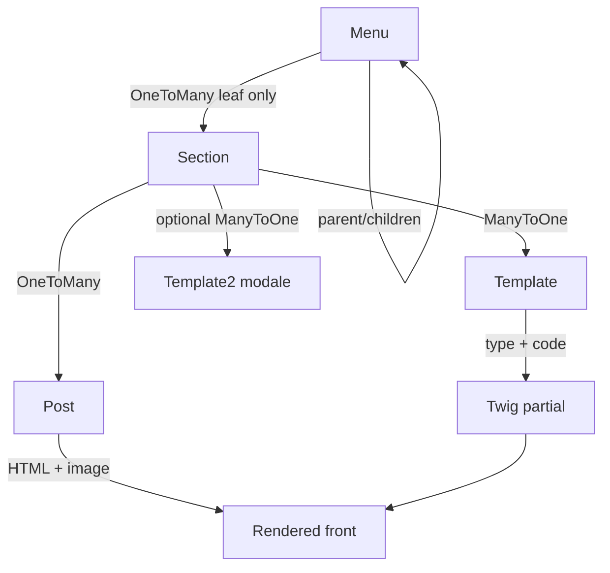

# Hermes CMS

Symfony-based CMS for structured showcase sites: hierarchical menus, typed sections, editorial operations, rich-text editing and Twig rendering — built for non-technical contributors without hiding the architecture from developers.

---

## Why Hermes?

A CMS is not a CRUD of pages. Contributors need to **model different kinds of content**, organise them in an **editorial structure**, edit with tools adapted to each type, and keep **content separated from presentation**.

Hermes addresses that for **sites vitrines** (marketing / institutional websites):

- Pages are nodes in a **menu tree**, not flat records.
- A page is composed of **sections**, each bound to a **template type** (free HTML, image galleries, forms, global footer/topbar…).
- Sections hold **posts** (text, image, publication window) whose meaning depends on the section template.
- Presentation (layout width, colours, columns, modal overlay) lives on the section; content lives on posts.
- The front resolves the tree and template code to **Twig partials**, so the same content model can render many layouts.

Hermes is a **concrete Symfony implementation** of these CMS concerns — not a marketing shell over a generic admin.

> Hermes is **not** an Ibexa (or eZ Platform) product, fork, or wrapper. It does **not** use Ibexa. Some architectural *concerns* (structured content, content tree, content types, editorial UI) overlap with enterprise CMS/DXP platforms; the implementation is Hermes’ own.

---

## Fonctionnalités

### Content management

- Hierarchical **menus** (roots, navigation nodes, leaf pages) with position, slug, locale and stable `referenceName`
- **Sections** attached to a page (or global footer/topbar), each with a primary **Template** and optional secondary modal template
- **Posts** inside sections: name, HTML content, image, active flag, optional publication dates
- Create posts from a menu (creates section + post) or into an existing section
- Reorder menus / sections / posts; toggle active state (admin JSON endpoints)
- **Copy / move** sections and posts between pages (`ContentTransferService`)
- **Locale copy**: duplicate a content tree to another locale (`LocaleCopyService`)
- Bulk import of list images from the media tree into a `liste` section
- Clear all posts of a `liste` section while keeping the section shell
- Migration tooling from Hermes 2.2.x SQLite + media layout

### Editorial experience

- Admin **pages list** with inline section presentation controls (width, transparent background, background/text colours, columns, image filter, GSAP effect for folio2, modal template)
- **CKEditor 5** for free-form content (Stimulus + Asset Mapper)
- Typed forms in admin driven by section template type (`liste` / `libre` / `formulaire`)
- Global **footer** and **topbar** section screens
- Site-wide **configuration** (colours, navbar, forms, fonts…) stored as typed `Config` entities
- Content transfer UI (copy/move targets by locale/page)
- Optional remote **libre** HTML catalog via Hermes API (encrypted login + JWT)

### Content types (templates)

Templates are defined in `config/hermes_templates.yaml` and persisted as `Template` entities (`code`, `type`, `name`, `summary`, `active`). Front rendering switches on `type` + `code`.

| Type | Role (from code / YAML) |
|------|-------------------------|
| **`libre`** | Free HTML posts rendered via CKEditor content (`libre`, also `newsletter_template` for campaigns) |
| **`liste`** | Image-driven layouts: folios, carousels, cards (`folio1`–`folio4`, `folio_video1`, `carousel1`, `carousel3`; several codes inactive by default) |
| **`formulaire`** | Front forms: `contact`, `newsletter`, `livredor` (+ optional `booking` when the booking module is active) |
| **`footer` / `topbar`** | Global sections, not attached to a page menu |
| **`modale`** | Secondary presentation on liste sections (`modale1`, `modale2` as `section.template2`) |
| **`livredor`** | Additional guestbook-related template code (`livredor1`) in YAML |

Each type drives admin field visibility and the Twig include used on the front.

### Media management

- **Admin media tree** (browse, mkdir, rename, delete folder/file) under a configurable public path — Symfony controllers, not elFinder
- **Uppy** dashboard upload (XHR) to the admin media API
- **VichUploader** on posts (and config images): mapped upload fields, custom directory/file namers
- CKEditor **Simple Upload** to `/api/file/upload` into the same media root
- **LiipImagineBundle** is installed; no project-specific filter sets / Twig `imagine_filter` usage were found in templates

### Forms

Front forms (contact, newsletter, guestbook):

- Symfony Form types + Twig section templates
- Presentation resolved from configs (`FormPresentationResolver`: colours, widths, rounding…)
- POST handlers with **honeypot**, signed timestamp window, minimum fill time, **IP rate limiting**
- Invalid submissions kept in session draft for redisplay
- Email delivery via Symfony Mailer (`SiteFormSubmissionMailer`)
- Newsletter subscriptions persisted as `User` with `ROLE_NEWSLETTER`
- Admin: newsletter subscriber list + campaign send from `newsletter_template` sections

Optional **booking** forms are provided by the separate [`atlas-services/hermes-booking-bundle`](https://github.com/atlas-services/HermesBookingBundle) (**MIT**, tagged **^1.0**) when enabled; routes are guarded if the module is inactive.

---

## Content model

Hermes models editorial structure as:

```text
Menu (tree, max depth 5)
 └── Section*          ← only on leaf menus (pages)
      ├── Template     ← content type / layout
      ├── Template2?   ← optional modale
      └── Post*
           ├── content (HTML text)
           ├── image (Vich)
           └── publication window
```

Global sections (footer / topbar) reuse the same `Section` / `Post` model with `menu = null` and a dedicated template code.



**Design observations from the code:**

- Hierarchy is on **Menu**, not on Post: posts are ordered items inside a typed section.
- A menu with children cannot hold sections (`Menu::addSection` / `PostService` guard leaf menus).
- `referenceName` links the same logical menu/footer across locales for the language switcher and locale copy.
- Section presentation fields (`transparent`, `template_bgcolor`, `template_color`, widths, columns…) keep layout concerns off the post HTML when possible.

---

## Content tree & editorial organization

### Tree navigation

- Admin menu tree (`MenuController` + `MenuTreeBuilder`)
- Front resolution by **slug path** (`MenuRepository::findOneBySlugPath`, depth capped by `Menu::MAX_DEPTH`)
- Visible sections filtered by active flags, locale and template rules (`FrontMenuService`)

### Editorial operations

| Operation | Where |
|-----------|--------|
| Create page content | `PostService::createFromMenu` / `createForSection` |
| Reorder | `BaseController::updatePositions` (`menu` \| `section` \| `post` \| `config`) |
| Activate / deactivate | `BaseController` switch-active endpoints |
| Move post (change section) | `PostService::move` (may remove empty source section) |
| Copy / move section or post between pages | `ContentTransferService` |
| Duplicate locale tree | `LocaleCopyService::copyLocale` |
| Delete section / clear liste images | `PostController` + `PostService` |

### Integrity concerns handled in code

- Leaf-only content attachment
- Position sequences per parent / section / footer / topbar
- Unique post name per section; unique root menu name per locale (custom validator)
- Cascading Doctrine removes on menu/section delete
- Copy of posts can duplicate image files; locale copy clones text/metadata but **not** images
- Locale copy refuses target locales that already contain menus/posts
- Global sections are excluded from page content-transfer

---

## Rich text editing

CKEditor 5 is integrated without FOSCKEditorBundle:

1. **Asset Mapper / importmap** packages: `ckeditor5`, CSS, French translations (`assets/ckeditor5.js`)
2. **Stimulus** controller `ckeditor5` mounts Classic Editor on textareas
3. Symfony form type `CKEditor5Type` (extends `TextareaType`) attaches the controller
4. Used on `PostType` when the section type is `libre` (and related flows)
5. HTML is stored in `Post::$content` (`ContentTrait`, Doctrine `text`)
6. Front renders with Twig `|raw` inside `.post-content`
7. Image upload from the editor hits `/api/file/upload`
8. `PostListener` normalises iframe `sandbox` attributes on post update when present

Libre section examples (show-room HTML) live under `templates/exemple/` and are meant to be pasted into CKEditor (including Source editing when scripts are required for GSAP demos).

---

## Architecture

```text
src/
├── Command/              # Console bootstrap & migration commands
├── Config/               # Typed config definitions & normalisation
├── Controller/
│   ├── Admin/            # Back-office (menus, posts, media, config…)
│   └── Api/              # File upload API for CKEditor
├── DataFixtures/
├── Entity/ + Traits/     # Menu, Section, Post, Template, Config, User
├── Enum/                 # e.g. FormTemplateKind
├── EventListener/        # Doctrine PostListener
├── EventSubscriber/      # Booking route guard, front 404 redirect
├── Form/ (+ Admin, Front)
├── Repository/
├── Service/              # Domain / application services
│   ├── ContentTransfer/
│   ├── Migration/
│   └── Booking/
├── Twig/                 # Extensions & Twig functions
├── Upload/Namer/         # Vich namers
└── Validator/Constraints/
```

**Layering (as practised in the codebase):**

- **Controllers** handle HTTP, forms, redirects and JSON admin endpoints.
- **Repositories** encapsulate Doctrine queries (slug paths, visible posts, footer/topbar, positions…).
- **Services** own editorial rules (create/move/copy, form submission, media FS, config merge, locale copy, mail).
- **Twig extensions** expose front helpers (forms, colours, booking context, sitemap…).
- **Entities** model the content repository; traits share id/name/slug/position/active/locale/image behaviour.

---

## Symfony architecture

Mechanisms actually used:

| Area | Usage in Hermes |
|------|-----------------|
| **Symfony 8 / PHP 8.4+** | Framework constraint (`composer.json`) |
| **Doctrine ORM + Migrations** | Content persistence |
| **Forms + Validator** | Admin & front forms; custom constraints |
| **Security** | Form login, CSRF, `ROLE_ADMIN` / `ROLE_SUPER_ADMIN`, entity user provider |
| **Twig** | Front & admin templates |
| **Asset Mapper + importmap** | Front/admin JS/CSS without mandatory Node build |
| **Stimulus / UX** | CKEditor mount, admin interactions, autocomplete, icons, Twig components |
| **Mailer** | Form submissions & newsletter campaigns |
| **Console** | Init, user creation, Hermes 2.2 migration |
| **Rate limiter** | Front form spam protection |
| **Expression language** | Available; access control currently uses role checks on admin paths |
| **StofDoctrineExtensions** | e.g. Gedmo slug on menus |
| **VichUploader** | Entity uploads |
| **HttpClient** | Hermes API client for remote templates / legal pages |

Not observed as a first-class Hermes CMS feature: Messenger queues, API Platform content API, security Voters.

---

## Domain / business logic

Logic is concentrated in services rather than controllers. Examples:

- **`PostService`** — Creating a post from a menu implies creating a section with defaults (template, width, default modale); move/delete maintain empty-section cleanup; liste-only bulk clear.
- **`FrontMenuService`** — What is “visible” on the front (active, locale, empty sections vs formulaire exception, global vs page sections).
- **`ContentTransferService`** — Copy/move across pages with file duplication rules and rejection of global sections.
- **`FrontFormSubmissionHandler`** — Orchestrates spam checks, validation, mail and newsletter registration without putting that flow in the controller.
- **`ConfigGlobalsProvider` + `ConfigDefinitionRegistry`** — Typed configuration (booleans, colours, widths) merged from YAML defaults and DB.
- **`BackgroundColorResolver`** — Presentation cascade section → content → site colours.
- **`MenuManager` / `MenuContactProvisioner`** — Depth limits, unique references, auto contact section when naming a menu “contact”.

---

## Events & extensibility

Hermes uses the Symfony/Doctrine event stack for **targeted** decoupling (not a full event-sourced CMS):

- **`PostListener`** (Doctrine `postUpdate`) — content normalisation for embeds.
- **`HermesBookingRouteGuardSubscriber`** — hides booking routes when the optional module is inactive.
- **`FrontNotFoundRedirectSubscriber`** — front 404 → home (with exclusions for profiler/API/admin).

Extensibility levers that exist without claiming a plugin marketplace:

- New **templates** via YAML + Twig partial + optional admin behaviour
- Typed **configs** via registry/normaliser
- Optional **booking** bundle behind a feature flag
- Stimulus controllers for admin/front behaviours
- Compiler passes / DI under `src/DependencyInjection` when needed

---

## Persistence

- Entities: `Menu`, `Section`, `Post`, `Template`, `Config`, `User`
- Repositories with **domain-oriented** queries (slug paths, visible search, newsletter campaign sections, footer/topbar by locale)
- Relations: self-referencing menu tree; section→menu (nullable); section→template(s); post→section; cascades and orphanRemoval where appropriate
- Default local setup uses **SQLite** (`DATABASE_URL` → `data/db/${APP_DB}`); Docker Compose provides optional **PostgreSQL**
- Schema changes via Doctrine Migrations (`migrations/`)

---

## Security

Present in code:

- Form login / logout with CSRF
- Password hashing (`auto`)
- Role hierarchy: `ROLE_SUPER_ADMIN` → `ROLE_ADMIN` → `ROLE_USER`
- Admin routes under `/{locale}/admin` require **`ROLE_ADMIN`**
- Newsletter-related roles on `User` (`ROLE_NEWSLETTER`, `ROLE_TEST_NEWSLETTER`) for subscribers/campaigns
- Front form anti-abuse (honeypot, timing, rate limit)
- Encrypted API credentials helper for remote Hermes API (`HermesEncryptionService`)

Not present: content-level ACL voters, workflow “publish approval” states beyond post active + date window.

---

## Code quality & testing

| Tool | Status |
|------|--------|
| PHPUnit | Yes (`phpunit.dist.xml`, ~45 `*Test.php` under `tests/`) |
| PHPStan | Yes (`phpstan.dist.neon`, level 6) |
| PHP-CS-Fixer | Yes (`.php-cs-fixer.dist.php`, `@Symfony`) |
| PHPCS | Yes (`phpcs.xml.dist`, PSR-12) |
| Fixtures | Doctrine Fixtures Bundle (dev) |
| CI (`.github/workflows`) | **Not present** in this repository |

Tests cover services heavily (forms, content transfer, migration helpers, config typing…), plus selected controllers, entities, repositories, Twig and validators.

---

## Developer experience

### Requirements

- PHP **8.4+**
- Composer
- Extensions typically needed: `ctype`, `iconv`, `curl`, `gd`, `dom`, `zip`, `mbstring`, `intl`, plus SQLite and/or PDO PostgreSQL depending on `DATABASE_URL`

### Install (Linux / Symfony CLI)

```bash
git clone <this-repository-url> hermes3
cd hermes3
composer install
# Configure .env.local (APP_NAME, APP_DB, DATABASE_URL, mailer, APP_BASE_MEDIA_DATA, …)
php bin/console doctrine:migrations:migrate
php bin/console app:init-hermes
php bin/console app:create-user
# optional:
php bin/console app:init-welcome-site
php bin/console app:init-mentions-legales
```

`composer install` / `update` run Asset Mapper install & compile via Flex auto-scripts. Vendor front packages land in `assets/vendor/` via:

```bash
php bin/console importmap:install
```

Start:

```bash
symfony server:start
# or: php -S 127.0.0.1:8000 -t public
```

Admin: `/{locale}/admin/` (e.g. `/fr/admin/`) after creating a `ROLE_ADMIN` user.

Optional Docker services: `compose.yaml` / `compose.override.yaml` (PostgreSQL, Mailpit in override).

### Useful commands

| Command | Purpose |
|---------|---------|
| `app:init-hermes` | Sync templates & configs from YAML into DB |
| `app:create-user` | Create an admin / user |
| `app:init-welcome-site` | Bootstrap home when empty |
| `app:init-mentions-legales` | Legal pages from Hermes API templates |
| `app:migrate` | Import Hermes 2.2.x SQLite |
| `app:migrate-media` | Import legacy media tree |

### Migration from Hermes 2.2.x

```bash
php bin/console app:migrate /path/to/old.sqlite data/db/target.sqlite --force
php bin/console app:migrate-media data/db/target.sqlite /path/to/old/uploads public/uploads/<name>
```

Align `APP_NAME` / upload paths with the target stem when using defaults. See command help for `--dry-run` / `--overwrite`.

---

## Screenshots / Demo

This repository does **not** currently ship screenshot assets under `docs/` or `screenshots/`.

Interfaces worth capturing for a portfolio:

1. Menu tree / pages list with sections  
2. Post edit with CKEditor 5  
3. Liste section (folio/carousel) + optional modale  
4. Content transfer (copy/move)  
5. Media upload tree (Uppy)  
6. Front form sections (contact / newsletter)  

Public show-room references (external): [modeles.hermes-cms.org](http://modeles.hermes-cms.org) / related Atlas model sites — useful for presentation, not part of the git tree.

HTML layout examples for libre sections: `templates/exemple/`.

---

## Technical design decisions

Observations grounded in the current code (not historical claims):

1. **Menu tree + typed sections** — Separates navigation/IA from layout variants without a deep nested “block tree” on every page.
2. **Template `type` + `code`** — One axis for admin/form behaviour (`liste`/`libre`/`formulaire`), one axis for Twig include selection.
3. **Presentation on Section** — Background, transparency, columns and filters can change without rewriting post HTML.
4. **Services for editorial ops** — Controllers stay thin; move/copy/locale rules are testable in isolation.
5. **Asset Mapper + Stimulus** — Keeps the CMS maintainable without forcing a Node/Webpack pipeline for core admin/front JS.
6. **Uppy + Symfony FS API** — Replaces elFinder with an explicit media boundary owned by the application.
7. **Typed config registry** — Avoids ad-hoc stringly-typed switches for every admin config field.

---

## CMS concepts and transferable skills

Working on Hermes exercises practical CMS/DXP-adjacent skills:

- Content modeling (menu / section / post / template)
- Content types and layout variants
- Hierarchical content tree and integrity rules
- Editorial operations (reorder, activate, copy, move, locale duplication)
- Rich-text editing integrated with Symfony Forms
- Media library boundaries and entity uploads
- Twig content rendering pipelines
- Front forms with spam controls and mail delivery
- Symfony service / repository / form layering
- Automated tests and static analysis on domain code

---

## Relation to modern Symfony CMS / DXP architectures

Several architectural concerns addressed by Hermes are also found in enterprise CMS/DXP platforms, such as **structured content**, **content trees**, **content types**, **editorial management** and **extensibility**.

Hermes implements those concerns for **showcase websites** with an explicit Symfony domain model. It should be read as **hands-on experience with CMS problem spaces**, not as feature parity with any specific commercial product.

---

## Technology stack

- PHP 8.4+
- Symfony 8
- Doctrine ORM & Migrations
- Twig
- Bootstrap 5
- Symfony UX (Stimulus, Autocomplete, Icons, Twig Component)
- Asset Mapper / importmap
- CKEditor 5
- Uppy (admin uploads)
- VichUploaderBundle
- LiipImagineBundle
- StofDoctrineExtensionsBundle
- PHPUnit, PHPStan, PHP-CS-Fixer, PHPCS

Optional: Hermes Booking Bundle (`^1.0`, MIT), Docker Compose (PostgreSQL / Mailpit).

---

## Roadmap

No formal roadmap document or widespread `TODO` markers were found in `src/`. Natural evolution axes already suggested by the architecture:

- Broader automated coverage / CI wiring
- Stronger media processing (Imagine filter sets if needed)
- Deeper multi-locale media handling (locale copy currently skips images)
- Documentation screenshots for recruiters and contributors

Treat these as **possible** directions, not committed deliverables.

---

## What this project demonstrates

- Designing a structured content model (Menu → Section → Post → Template)
- Building and maintaining a hierarchical editorial tree with constraints
- Implementing editorial operations (create, reorder, activate, copy, move, locale copy)
- Integrating CKEditor 5 with Symfony Forms, storage and Twig rendering
- Separating presentation configuration from content payloads
- Organising Symfony code into Controllers, Repositories, Services and Twig extensions
- Building admin UX with Stimulus and Asset Mapper
- Managing media through application-owned APIs (Uppy + Vich)
- Implementing front forms with validation, anti-abuse and mail delivery
- Applying PHPUnit tests and static analysis (PHPStan / CS tools) to CMS domain logic

---

## License

Hermes CMS is released under the **MIT** license — the same license as [Symfony](https://github.com/symfony/symfony/blob/8.0/LICENSE). See [LICENSE](LICENSE).

Copyright: **© 2021-present** Tayeb CHIKHI (Hermes from 2021, Hermes3 from 2026). The `-present` form stays valid without yearly updates.

---

## Show-room & contact

- Template show-room: [modeles.hermes-cms.org](http://modeles.hermes-cms.org)
- Example sites referenced historically under `*.atlas-services.fr`
- Contact: [contact@hermes-cms.org](mailto:contact@hermes-cms.org)
